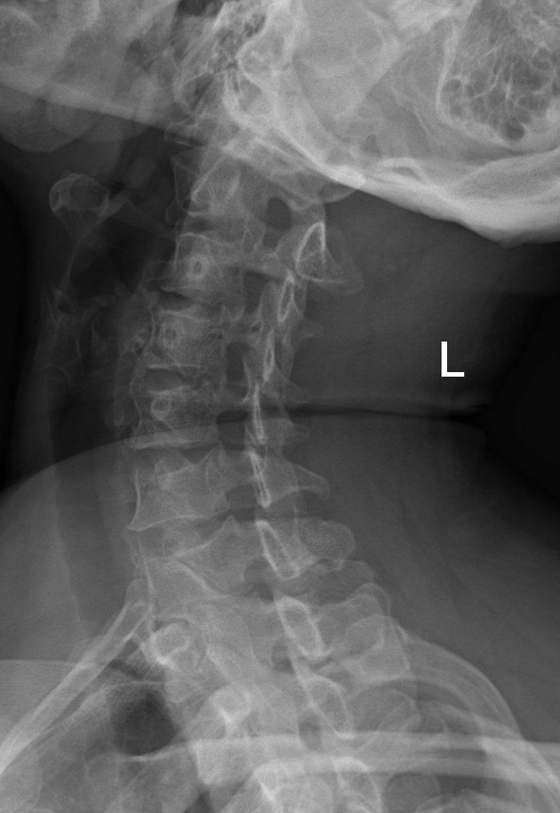
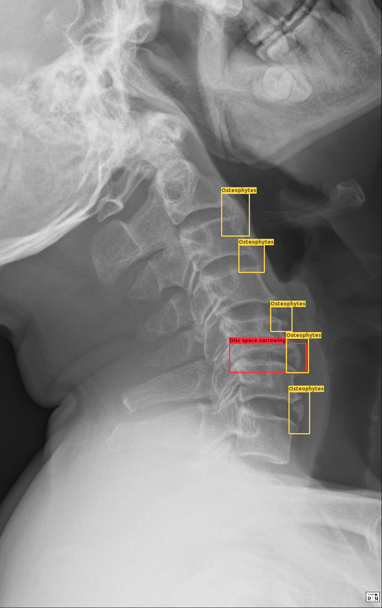
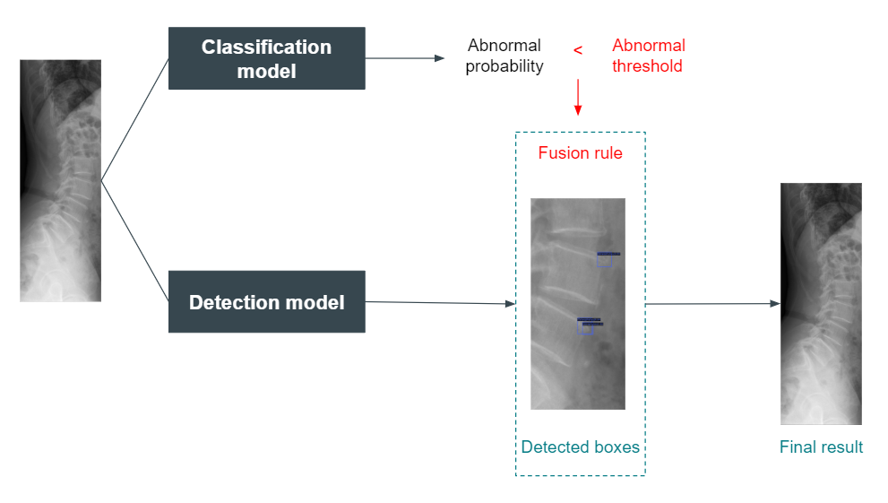
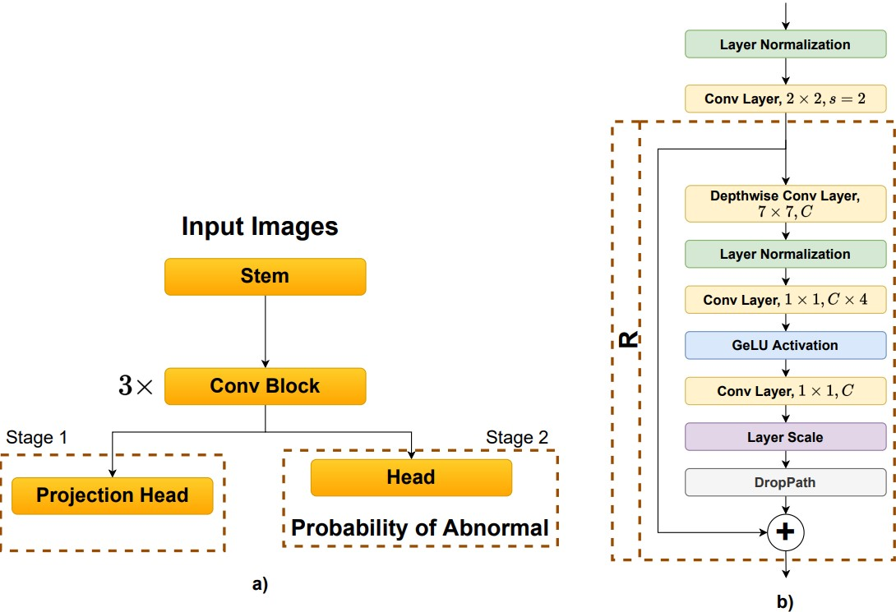

<div align="center">


# SpineXR Detection

_Abnormalities classification and detection for spinal lesions in radiographs collected by [vindr-spinexr](https://github.com/vinbigdata-medical/vindr-spinexr)._

</div>

In this project, we employ the tasks of detecting spinal lesions by using a combined classification and detection framework. Specifically, the main contributions are:

1. Problem formulation.
2. Preprocessing.
3. Analyze the dataset.
4. Improve classification performance by applying contrastive learning feature branch.
5. Evaluate the effectiveness of employing classification knowledge on detection results.


## Screenshots

### Normal images



### Abnormal images


## Usage
## Important notes!!

> **Note** that you will need to register an account to access the dataset.
>
> Please make sure you are following [Physionet agreement terms](https://physionet.org/content/vindr-spinexr/1.0.0/).
>
> All the main files are under SpineXR-detection/mmdetection/spinexr_det/. Go to the path before executing all following commands.
>
> The weights of our classification and detection tasks can be found at this [drive](https://drive.google.com/drive/folders/14dB6Gn3c8u7QKrgwfh71qLwaTw0kptyv?usp=sharing).


```
wget -r -N -c -np --user giaabaoo --ask-password https://physionet.org/files/vindr-spinexr/1.0.0/
```

To visualize the dataset, use the following command:
```
python visualize_bb.py
```


## Preprocess dataset

For the classification task, images are preprocessed regarding the following script:

```
python preprocess_images_cls.py
```

For the detection task, we will need to convert our annotations format into coco format so that the models using mmdetection can be run and evaluated successfully. This consists of two steps:

1. Convert VOC format to YOLO format:
```
python voc_to_yolo.py
```
2. Convert YOLO format to COCO format:
```
sh yolo_to_coco.sh
```

## Overall framework

1. **Train classification task**
    1. Preprocess images for classification task.
    2. Train contrastive learning loss to learn a model to generate good latent space.
    3. Continue training the second stage to predict the abnormalities of images.
2. **Train detection task**
    1. Preprocess annotations for detection task.
    2. Configure the settings to train the network with mmdetection.
3. **Inference using both classification and detection branch**
    1. If the image is classified as normal, reject all the detected boxes. Otherwise, all bounding boxes from the detector is retained.



### Train classification



To train the classification task, run the following command:

```
python classification/train.py
```

### Train detection

To conduct the training on Cascade RCNN with DCN and FPN architecture, use our script:

```
sh train.sh
```

To evaluate, run:

```
sh test.sh
```

Besides the given configs for our experimented model, you can also follow the configs procedure from [MMDetection](https://github.com/open-mmlab/mmdetection/tree/master/configs) to experiment on other supported detectors.

### Demo

Combine classification results to refine the boxes in the detection task using:

```
python combine_cls_2_det_infer.py
```


**Annotation**

Following COCO format:

```json
{
    "images": [
        {
            "file_name": "1f1c5c098c35b79052596aae08ac727f.png",
            "height": 2874,
            "width": 1183,
            "id": 0
        },
        {
            "file_name": "9f4fb4f51315715cf1048fcc2f7d6f47.png",
            "height": 2874,
            "width": 1021,
            "id": 1
        }
    ],
    "categories": [
        {
            "supercategory": "Defect",
            "id": 1,
            "name": "Osteophytes"
        },
        {
            "supercategory": "Defect",
            "id": 2,
            "name": "Other lesions"
        },
        {
            "supercategory": "Defect",
            "id": 3,
            "name": "Spondylolysthesis"
        },
        {
            "supercategory": "Defect",
            "id": 4,
            "name": "Disc space narrowing"
        },
        {
            "supercategory": "Defect",
            "id": 5,
            "name": "Vertebral collapse"
        },
        {
            "supercategory": "Defect",
            "id": 6,
            "name": "Foraminal stenosis"
        },
        {
            "supercategory": "Defect",
            "id": 7,
            "name": "Surgical implant"
        }
    ],
    "annotations": [
        {
            "id": 1,
            "image_id": 0,
            "bbox": [
                712.0,
                961.0,
                73.0,
                50.0
            ],
            "area": 3650,
            "iscrowd": 0,
            "category_id": 1,
            "segmentation": []
        },
        {
            "id": 2,
            "image_id": 0,
            "bbox": [
                789.0,
                1452.0,
                90.0,
                53.0
            ],
            "area": 4770,
            "iscrowd": 0,
            "category_id": 1,
            "segmentation": []
        },
        {
            "id": 3,
            "image_id": 0,
            "bbox": [
                692.0,
                655.0,
                53.0,
                53.0
            ],
            "area": 2809,
            "iscrowd": 0,
            "category_id": 1,
            "segmentation": []
        },
        {
            "id": 4,
            "image_id": 0,
            "bbox": [
                820.0,
                1603.0,
                90.0,
                67.0
            ],
            "area": 6030,
            "iscrowd": 0,
            "category_id": 1,
            "segmentation": []
        },
        {
            "id": 5,
            "image_id": 0,
            "bbox": [
                739.0,
                1203.0,
                80.0,
                36.0
            ],
            "area": 2880,
            "iscrowd": 0,
            "category_id": 1,
            "segmentation": []
        },
        {
            "id": 6,
            "image_id": 0,
            "bbox": [
                860.0,
                1710.0,
                80.0,
                60.0
            ],
            "area": 4800,
            "iscrowd": 0,
            "category_id": 1,
            "segmentation": []
        },
        {
            "id": 7,
            "image_id": 0,
            "bbox": [
                793.0,
                1368.0,
                63.0,
                47.0
            ],
            "area": 2961,
            "iscrowd": 0,
            "category_id": 1,
            "segmentation": []
        },
        {
            "id": 8,
            "image_id": 0,
            "bbox": [
                732.0,
                1119.0,
                67.0,
                57.0
            ],
            "area": 3819,
            "iscrowd": 0,
            "category_id": 1,
            "segmentation": []
        },
        {
            "id": 9,
            "image_id": 0,
            "bbox": [
                699.0,
                517.0,
                60.0,
                47.0
            ],
            "area": 2820,
            "iscrowd": 0,
            "category_id": 1,
            "segmentation": []
        },
        {
            "id": 10,
            "image_id": 0,
            "bbox": [
                877.0,
                1892.0,
                73.0,
                60.0
            ],
            "area": 4380,
            "iscrowd": 0,
            "category_id": 1,
            "segmentation": []
        },
        {
            "id": 11,
            "image_id": 1,
            "bbox": [
                658.0,
                601.0,
                40.0,
                53.0
            ],
            "area": 2120,
            "iscrowd": 0,
            "category_id": 1,
            "segmentation": []
        },
        {
            "id": 12,
            "image_id": 1,
            "bbox": [
                635.0,
                685.0,
                70.0,
                43.0
            ],
            "area": 3010,
            "iscrowd": 0,
            "category_id": 1,
            "segmentation": []
        },
        {
            "id": 13,
            "image_id": 1,
            "bbox": [
                779.0,
                1673.0,
                90.0,
                97.0
            ],
            "area": 8730,
            "iscrowd": 0,
            "category_id": 1,
            "segmentation": []
        },
        {
            "id": 14,
            "image_id": 1,
            "bbox": [
                692.0,
                1166.0,
                94.0,
                63.0
            ],
            "area": 5922,
            "iscrowd": 0,
            "category_id": 1,
            "segmentation": []
        },
        {
            "id": 15,
            "image_id": 1,
            "bbox": [
                746.0,
                1593.0,
                84.0,
                50.0
            ],
            "area": 4200,
            "iscrowd": 0,
            "category_id": 1,
            "segmentation": []
        },
        {
            "id": 16,
            "image_id": 1,
            "bbox": [
                756.0,
                1892.0,
                77.0,
                43.0
            ],
            "area": 3311,
            "iscrowd": 0,
            "category_id": 1,
            "segmentation": []
        },
        {
            "id": 17,
            "image_id": 1,
            "bbox": [
                742.0,
                1421.0,
                97.0,
                63.0
            ],
            "area": 6111,
            "iscrowd": 0,
            "category_id": 1,
            "segmentation": []
        },
        {
            "id": 18,
            "image_id": 1,
            "bbox": [
                662.0,
                836.0,
                57.0,
                50.0
            ],
            "area": 2850,
            "iscrowd": 0,
            "category_id": 1,
            "segmentation": []
        },
        {
            "id": 19,
            "image_id": 1,
            "bbox": [
                695.0,
                1075.0,
                60.0,
                63.0
            ],
            "area": 3780,
            "iscrowd": 0,
            "category_id": 1,
            "segmentation": []
        },
        {
            "id": 20,
            "image_id": 1,
            "bbox": [
                672.0,
                917.0,
                67.0,
                63.0
            ],
            "area": 4221,
            "iscrowd": 0,
            "category_id": 1,
            "segmentation": []
        },
        {
            "id": 21,
            "image_id": 1,
            "bbox": [
                736.0,
                1331.0,
                70.0,
                47.0
            ],
            "area": 3290,
            "iscrowd": 0,
            "category_id": 1,
            "segmentation": []
        }
    ]
}
```

See [`public/annotation/sample.json`](public/sample.json) for am example.

## Citation
```
@InProceedings{nguyen2021vindr,
    author="Nguyen, Hieu T.
        and Pham, Hieu H.
        and Nguyen, Nghia T.
        and Nguyen, Ha Q.
        and Huynh, Thang Q.
        and Dao, Minh
        and Vu, Van",
    editor="de Bruijne, Marleen
        and Cattin, Philippe C.
        and Cotin, St{\'e}phane
        and Padoy, Nicolas
        and Speidel, Stefanie
        and Zheng, Yefeng
        and Essert, Caroline",
    title="VinDr-SpineXR: A Deep Learning Framework for Spinal Lesions Detection and Classification from Radiographs",
    booktitle="Medical Image Computing and Computer Assisted Intervention -- MICCAI 2021",
    year="2021",
    publisher="Springer International Publishing",
    address="Cham",
    pages="291--301",
    isbn="978-3-030-87240-3"
}
```
```
@article{mmdetection,
  title   = {{MMDetection}: Open MMLab Detection Toolbox and Benchmark},
  author  = {Chen, Kai and Wang, Jiaqi and Pang, Jiangmiao and Cao, Yuhang and
             Xiong, Yu and Li, Xiaoxiao and Sun, Shuyang and Feng, Wansen and
             Liu, Ziwei and Xu, Jiarui and Zhang, Zheng and Cheng, Dazhi and
             Zhu, Chenchen and Cheng, Tianheng and Zhao, Qijie and Li, Buyu and
             Lu, Xin and Zhu, Rui and Wu, Yue and Dai, Jifeng and Wang, Jingdong
             and Shi, Jianping and Ouyang, Wanli and Loy, Chen Change and Lin, Dahua},
  journal= {arXiv preprint arXiv:1906.07155},
  year={2019}
}
```
